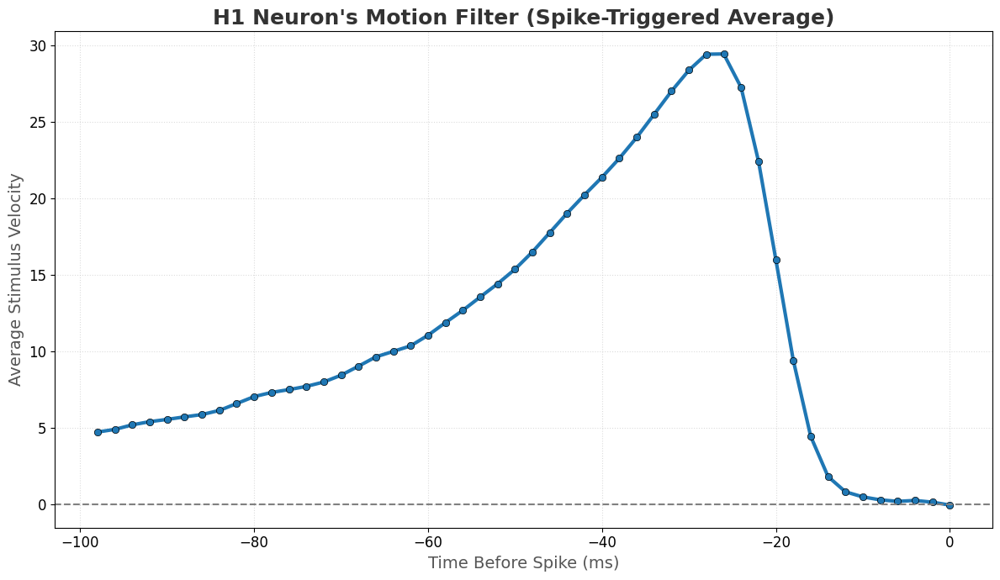

# Project: Reverse-Engineering the H1 Neuron's Motion Filter

This notebook analyzes real experimental data from the H1 neuron in the fly's visual system. 
Our goal is to use the Spike-Triggered Average (STA) method to find the neuron's "linear filter" (f). 
This project demonstrates: loading and exploring experimental data, implementing the STA algorithm from scratch, and interpreting the resulting filter.

---

## 1. How to Run (The Magic Button)

The easiest way to run this project is to click the badge below. This will open the entire analysis in a live Google Colab environment.

---

## 2. The Result: The Filter (The Output)

The analysis reveals the neuron's filter, which represents how it integrates stimulus motion over time.

## 3. Scientific Interpretation & Conclusion

The recovered filter is clearly **monophasic** (single-phased), remaining entirely in the positive domain. This indicates the neuron's preferred feature is **not** a sudden change of direction (accelerometer), but rather a **sustained integration of positive velocity**.

The filter shape shows the neuron gives the most "weight" (importance) to the stimulus that occurred approximately **25ms** before the spike. This is the optimal temporal pattern required to trigger the response.

---

## 4. Technical Specifications

* **Main Tool:** Spike-Triggered Average (STA)
* **Data:** Velocity time-series from the H1 neuron (Dr. Ruyter van Steveninck Lab).
* **Key Insight:** The STA is the geometric **projection** of the spike-triggered stimulus onto the axis of greatest information.
